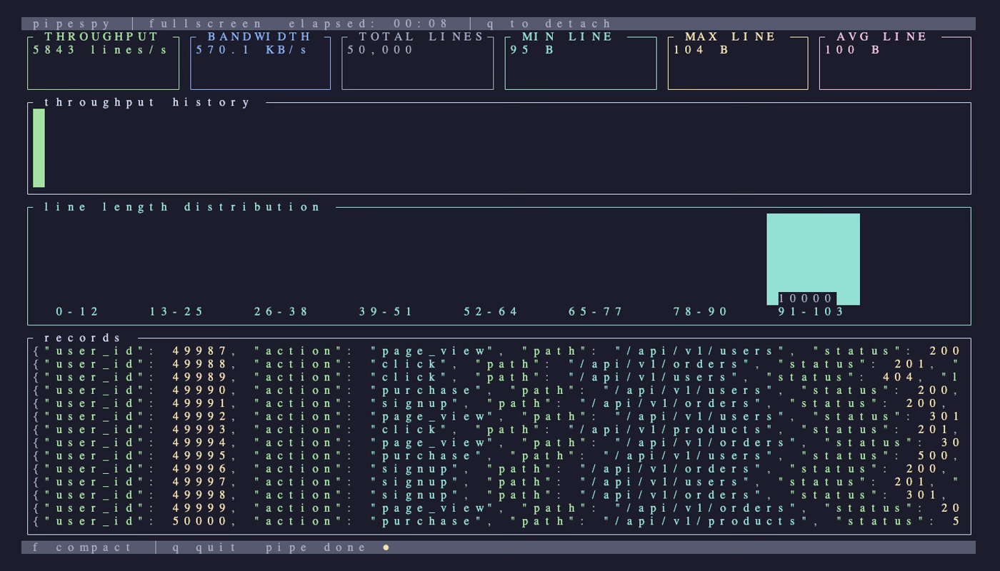

<div align="center">

# pipespy

**See your data, not just your bytes.**

`pv` shows throughput. `pipespy` shows what's actually flowing through.

[](https://crates.io/crates/pipespy)
[](LICENSE)
[](https://www.rust-lang.org/)
[](https://github.com/jasonm4130/pipespy/releases)

<br>


</div>

<br>

Debugging shell pipelines means guessing what's in the data mid-stream. `pv` tells you bytes per second. `jq` tells you nothing until the pipe is done. `pipespy` sits in the middle and shows you live record samples, throughput, format detection, and stats — without touching a single byte of your data.

```bash
cat events.jsonl | pipespy | jq '.users[]' | grep "active" > out.txt
```

## Why It Exists

I built this after spending too long guessing whether a stalled pipeline was a slow producer, a slow consumer, or bad data. `pv` shows MB/s. That's useful, but it tells you nothing about whether your JSONL is malformed or your CSV has inconsistent columns.

`pipespy` renders entirely to stderr so it never touches your data path. Every byte that enters stdin exits stdout, in order, unmodified. The TUI is a side-channel observer, not a filter.

## How It Works

```
stdin  ──▶  Reader Thread  ──▶  Ring Buffer  ──▶  Writer Thread  ──▶  stdout
                                     │
                               Stats Collector
                                     │
                               TUI Renderer  ──▶  stderr
```

Three threads, separated by design:

- **Reader** — pumps stdin into a shared ring buffer, records per-line statistics
- **Writer** — drains the buffer to stdout as fast as downstream can consume
- **TUI** — samples stats on a timer and renders to stderr via [ratatui](https://github.com/ratatui/ratatui)

The TUI thread never touches the data path. This separation is the core correctness guarantee: rendering to stderr means the alternate screen, raw mode, and all visual output are isolated from pipeline data. Data integrity is verified by integration tests.

## Tech Stack

- [Rust](https://www.rust-lang.org/) — single binary, no runtime dependencies
- [ratatui](https://github.com/ratatui/ratatui) — terminal UI framework
- [crossterm](https://github.com/crossterm-rs/crossterm) — cross-platform terminal control
- [clap](https://github.com/clap-rs/clap) — CLI argument parsing

## Install

**Homebrew** (macOS/Linux):

```bash
brew install jasonm4130/tap/pipespy
```

**Cargo** (requires [Rust](https://rustup.rs)):

```bash
cargo install pipespy
```

<details>
<summary>More install methods</summary>

**Shell one-liner** (download pre-built binary):

```bash
curl -fsSL https://raw.githubusercontent.com/jasonm4130/pipespy/main/install.sh | sh
```

**Build from source:**

```bash
git clone https://github.com/jasonm4130/pipespy.git
cd pipespy
cargo build --release
# Binary at target/release/pipespy
```

Pre-built binaries are available for macOS (arm64/amd64) and Linux (arm64/amd64) on the [releases page](https://github.com/jasonm4130/pipespy/releases).

</details>

## Quick Start

```bash
# See what's flowing through your pipeline
cat server.log | pipespy | grep ERROR > errors.txt

# Fullscreen mode with histogram and extended stats
cat events.jsonl | pipespy --fullscreen | jq '.' > out.json

# Quiet mode for scripts — just the summary
cat huge.jsonl | pipespy -q | jq '.' > out.json
# pipespy: 1,204,831 lines | 482MB | 14.2s | 33.9MB/s
```

## Features

### Two Display Modes

Press `f` to toggle between compact and fullscreen at any time.

**Compact** — fixed height, fits in a split pane. Shows throughput, sparkline, and live record samples.

**Fullscreen** — fills the terminal with extended stats (min/max/avg line size), a throughput history sparkline, line length histogram, and a scrollable record viewer.

<div align="center">

<br>
<sub>Fullscreen mode — throughput history, line length histogram, and extended stats</sub>
</div>

<br>

### Format Detection

pipespy detects your data format and adapts the display:

| Format | Detection | Display |
|--------|-----------|---------|
| **JSON** | Valid JSON objects per line | Syntax-highlighted keys, values, numbers |
| **CSV** | Consistent comma-separated columns | Color-coded columns |
| **Plain text** | Everything else | Raw display |

Override with `--json`, `--csv`, or `--no-detect`.

### Quiet Mode

Skip the TUI entirely. Get a one-line summary when the pipeline completes — useful for scripts and CI:

```
$ cat access.log | pipespy -q | awk '{print $1}' | sort -u > ips.txt
pipespy: 8,412,093 lines | 1.2GB | 4.7s | 255.3MB/s
```

## Keyboard Shortcuts

| Key | Action |
|:---:|--------|
| `f` | Toggle fullscreen / compact mode |
| `q` | Detach TUI and print summary |

## CLI Reference

```
pipespy [OPTIONS]

Options:
  -f, --fullscreen        Start in fullscreen mode
  -n, --sample-rate <N>   Show 1 in N records (default: auto)
  -b, --buffer <SIZE>     Ring buffer size in bytes (default: 8MB)
      --no-detect         Skip format detection, treat as plain text
      --json              Force JSON mode
      --csv               Force CSV mode
  -q, --quiet             No TUI, just print summary on completion
  -h, --help              Print help
  -V, --version           Print version
```

## Comparison with `pv`

| Feature | `pv` | `pipespy` |
|---------|:----:|:---------:|
| Bytes transferred | :white_check_mark: | :white_check_mark: |
| Line count | :x: | :white_check_mark: |
| Live record samples | :x: | :white_check_mark: |
| Format detection | :x: | :white_check_mark: |
| Syntax highlighting | :x: | :white_check_mark: |
| Throughput sparkline | :x: | :white_check_mark: |
| Line length histogram | :x: | :white_check_mark: |
| Fullscreen TUI | :x: | :white_check_mark: |
| Data integrity | :white_check_mark: | :white_check_mark: |

## Status

Active development. Core functionality is stable. See [issues](https://github.com/jasonm4130/pipespy/issues) for planned work.

## Contributing

```bash
# Clone and build
git clone https://github.com/jasonm4130/pipespy.git
cd pipespy
cargo build

# Run tests
cargo test

# Run locally
seq 1 100000 | cargo run
```

See [CONTRIBUTING.md](CONTRIBUTING.md) for guidelines.

## License

MIT. See [LICENSE](LICENSE).
